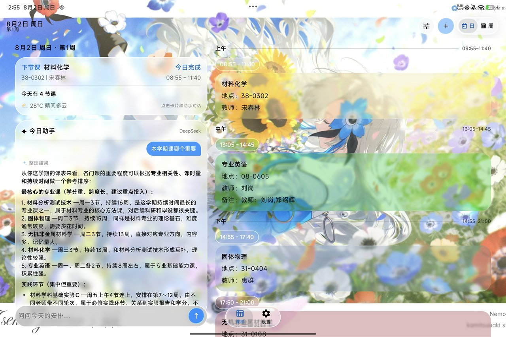
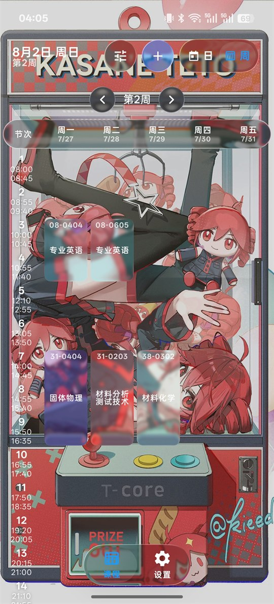
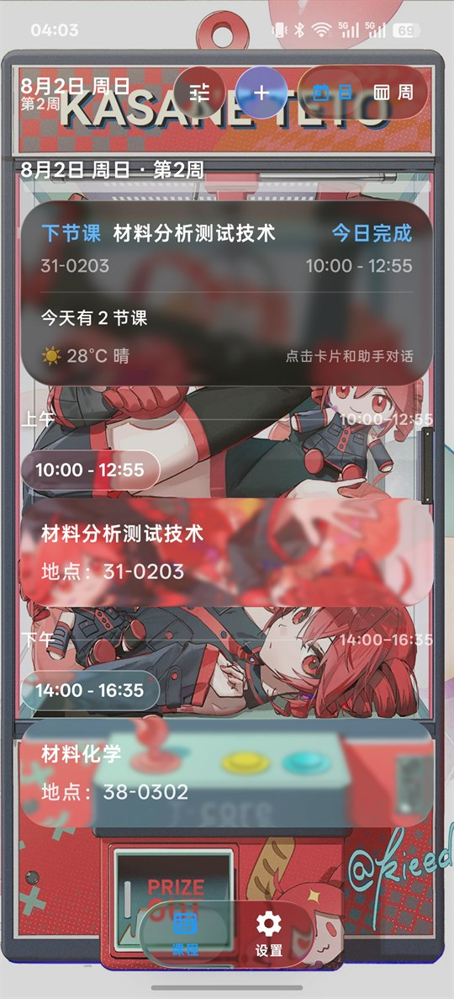
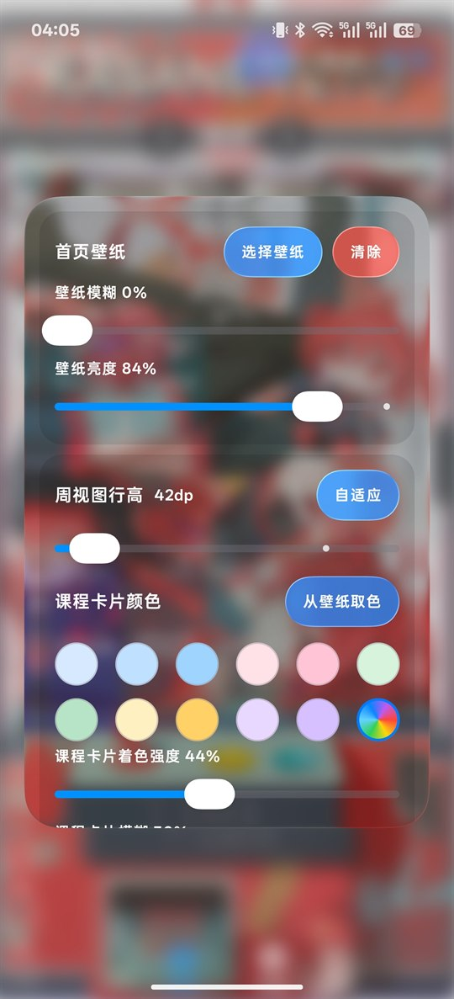
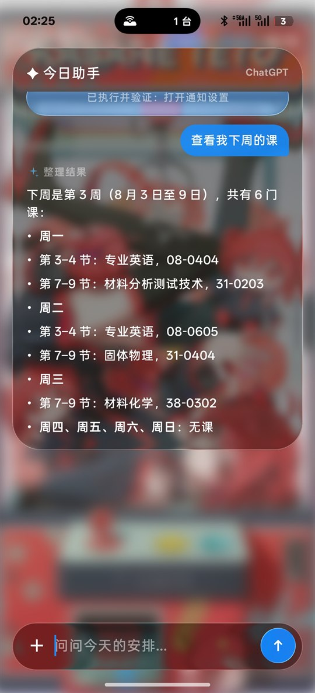
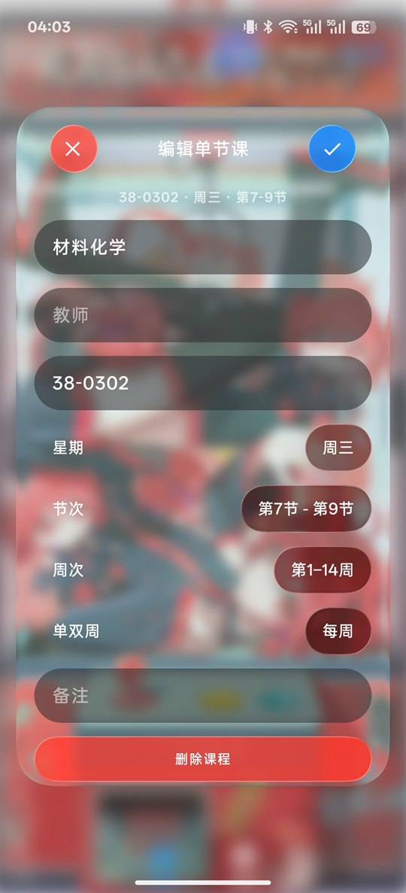
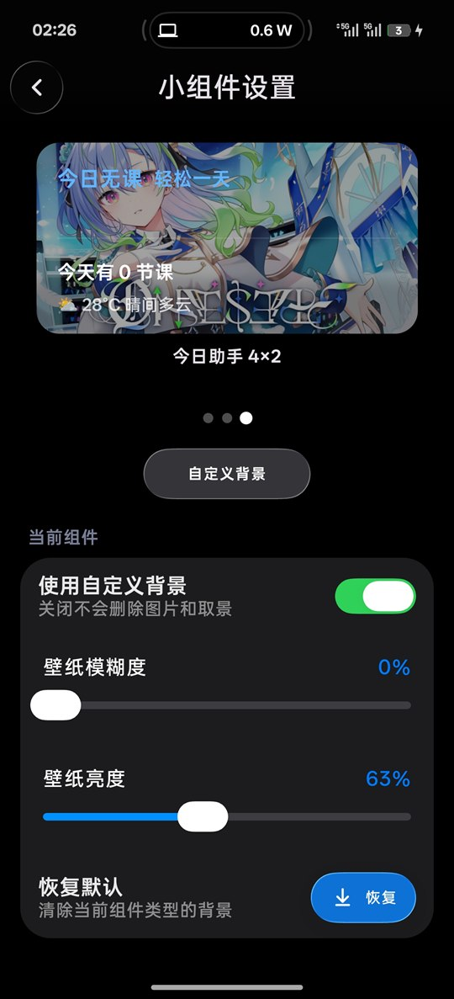
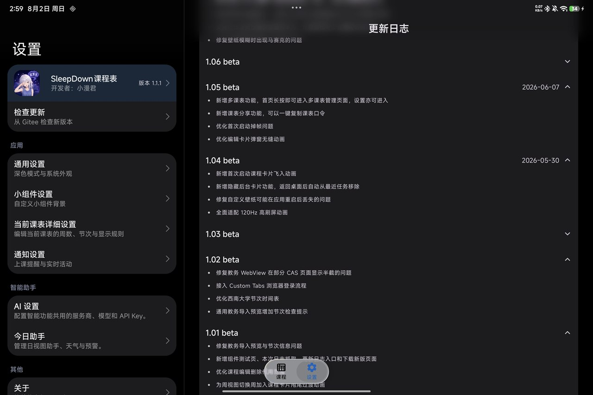

# SleepDown 课程表

> 一款基于 Jetpack Compose 与 Miuix 构建，融合液态玻璃视觉效果和 AI 能力的 Android 课程表。

> [!IMPORTANT]
> 本仓库是**源码可见项目，并非 OSI 定义的开源项目**。允许个人、非商业地克隆、编译和修改；对外提供任何修改版项目、源码、APK/AAB、应用或服务时，必须至少同步公开可查看/下载的对应源代码，并在发布页面和 App 内显著注明原作者 `xiaomanjun233`、原项目链接及“非官方修改版”，不得冒充原创或官方版本。仅发布二进制、反编译代码、私有/付费/受邀源码或不完整补丁均不符合要求。完整条款见 [SleepDown 署名非商业、源码可见许可 1.1](LICENSE.md)。

SleepDown 围绕课表的导入、维护、提醒与日常查看进行设计，并提供桌面组件、今日助手和较完整的个性化能力。无需注册账号，课表、设置、壁纸与助手数据默认存储在设备本地。

应用使用 Jetpack Compose 构建，界面以 Miuix 与液态玻璃效果为基础，并针对壁纸背景下的可读性、动画连续性以及手机和平板布局进行了专门适配。视觉效果之外，项目同样重视数据迁移安全、长期存储占用和复杂课表场景下的稳定性。

当前版本为 **1.2.0**，最低支持 Android 8.0（API 26）。正式身份已迁移到 `com.xiaomanjun.sleepdownschedule`；GitHub 与应用商店发行版共用这一 applicationId。安装包可以在 [GitHub Releases](https://github.com/xiaomanjun233/SleepDown-Schedule/releases) 或 [Gitee 发行版](https://gitee.com/xiaomanjun233/SleepDown-Schedule/releases) 下载。

### 从 1.1.5 迁移

旧包名 `com.example.courseschedule` 下的 v1.1.5 是旧应用身份的最终版本。由于 Android applicationId 机制，新包无法覆盖安装旧包，这是正常现象：

1. 在 v1.1.5 中导出 `.sleepdown` 备份。
2. 安装新包 `com.xiaomanjun.sleepdownschedule`。
3. 在新版本中恢复 `.sleepdown` 备份，并检查课表、设置和提醒。
4. 必要时重新配置 API Key 或教务登录凭据。
5. 确认无误后再卸载旧版本。

备份协议仍为 BackupFormatV1。新版本只接受自身包名或历史包名 `com.example.courseschedule` 创建的备份，未知来源会被拒绝；API Key、Cookie、Session/Access Token 等凭据不会加入普通备份。

## 界面预览

> 演示截图中的个性化壁纸来自 &#64;Rabbit_candy_i 与 &#64;kieed，仅用于展示应用界面效果，版权归原作者所有。如有侵权，请通过仓库 Issue 联系，将及时删除相关图片。

<p align="center">
  
</p>
<p align="center"><sub>平板日视图与内嵌今日助手</sub></p>

<table>
  <tr>
    <td align="center" width="33%"><br /><sub>周视图</sub></td>
    <td align="center" width="33%"><br /><sub>日视图</sub></td>
    <td align="center" width="33%"><br /><sub>液态玻璃个性化</sub></td>
  </tr>
  <tr>
    <td align="center" width="33%"><br /><sub>今日助手</sub></td>
    <td align="center" width="33%"><br /><sub>课程编辑</sub></td>
    <td align="center" width="33%"><br /><sub>桌面组件设置</sub></td>
  </tr>
</table>

<p align="center">
  
</p>
<p align="center"><sub>平板双栏设置页</sub></p>

## 它能做什么

### 课表

支持日视图与周视图，并可按学校实际安排配置学期日期、总周数和节次时间。课程既可按单周独立修改，也可批量更新同类课程；发生时间冲突时会先提示处理，而不会直接覆盖已有数据。当前教学周可根据开学日期自动推算。

### 导入

支持手动录入，以及从教务系统、ICS 文件、文本、表格、图片和 PDF 导入课表。教务系统的适配范围与数量以 [拾光仓库](https://github.com/xingheyuzhuan/shiguang_warehouse) 的当前支持列表为准，同时保留通用教务页面作为补充；AI 导入可使用 OpenAI、DeepSeek、小米 MiMo 或自定义兼容接口。所有导入结果都会先经过预览确认，再写入本地课表。

### 提醒和桌面组件

课程提醒支持自定义提前时间，并可在系统支持时通过实时活动展示上下课倒计时。项目提供今日课程与今日助手桌面组件，每个组件均可独立设置背景、取景、缩放、模糊和亮度。版本检查由用户控制，不会在后台强制下载更新。

### 今日助手

今日助手可结合当天课程、教学周和可选天气信息回答问题，并能够协助调整课程及部分应用设置。涉及数据变更时，助手会先展示操作计划，经用户确认后再执行。对话记录与长期记忆保存在本地，并支持查看、编辑和关闭。

### 外观

首页壁纸支持横竖屏独立取景，课程卡片的配色、透明度、模糊和玻璃效果均可调整。手机与平板采用不同的自适应布局，大屏环境下会重新组织日视图、周视图、设置页和今日助手，而非简单拉伸手机界面。应用图标可固定为浅色或深色，也可跟随系统深色模式切换。

## 基本使用

首次使用时，在“设置 → 课表设置”中配置开学日期与节次时间，然后通过首页右上角添加或导入课程。若需使用课程提醒，还需要在通知设置中启用相关功能，并按照设备系统要求授予通知与后台运行权限。

AI 功能为可选能力，不影响基础课表功能。启用时需要自行选择服务商与模型，并配置对应的 API Key。

> 实时活动的展示能力取决于手机厂商和系统版本。请以设备实际的通知权限、实时活动支持和后台限制为准。

## 数据与隐私

- 课表、设置、壁纸取景和助手记忆使用本地 Room 数据库或应用私有存储保存，不提供云同步。
- 卸载应用可能清除本地数据；重要课表建议保留原始导入文件或自行备份。
- AI 导入、AI 助手和天气功能会把实现该功能所需的数据发送到你选择的服务端；请确认服务商的隐私政策、计费规则和数据处理条款。
- 教务系统登录在 WebView/Custom Tabs 流程中完成；请只在可信的学校站点输入账号与密码。

## 获取项目（仅供学习）

两个代码托管平台保持同一份 `main` 分支代码：

```bash
# GitHub
git clone https://github.com/xiaomanjun233/SleepDown-Schedule.git

# Gitee
git clone https://gitee.com/xiaomanjun233/SleepDown-Schedule.git
```

分发或提供修改版时，必须同步公开对应源代码，使项目至少达到源码可见标准，并遵守许可证中的显著署名、修改说明和非官方标识要求；商业使用须另行取得书面授权。

- `main`：已验证的最新稳定代码。
- `v<版本号>`：正式发布版本标签，例如 `v1.1.1`。
- `feature/*`、`fix/*`、`release/*`、`codex/*`：短期开发分支，不作为长期下载入口。

## 项目结构

```text
CourseSchedule/
├── app/
│   ├── src/main/java/com/example/courseschedule/
│   │   ├── MainActivity.kt                  # Activity 入口与主题容器
│   │   ├── CourseScheduleApp.kt             # 进程级依赖与生命周期
│   │   ├── Data.kt                          # Room 实体、DAO、迁移和 Repository
│   │   ├── Schedule*.kt                     # 课表状态、逻辑、选择器与刷新协调
│   │   ├── *ScheduleUi.kt                   # 首页、周视图、编辑与设置界面
│   │   ├── AiImport.kt / ImportUi.kt        # AI、文件与手动导入
│   │   ├── EduImport.kt / EduPageCapture.kt # 教务网页导入和页面抓取
│   │   ├── DayAgent*.kt / Agent*.kt         # 今日助手、工具和服务端传输
│   │   ├── *Widget*.kt                      # 桌面组件及其个性化
│   │   └── GlassUi.kt / *Morph*.kt          # 玻璃材质与转场
│   ├── src/main/assets/shiguang_warehouse-main/
│   │                                        # 教务系统适配资源
│   └── src/test/ / src/androidTest/          # 单元测试、迁移和仪器测试
├── benchmark/                                # Macrobenchmark 与 Baseline Profile
├── docs/                                     # 版本说明、性能基线和节次方案文档
├── patches/miuix-0.9.3-sleepdown.patch      # Miuix 基础组合构建补丁
├── patches/miuix-cascading-popup-surface.patch
│                                           # 级联菜单玻璃表面扩展
├── THIRD_PARTY_NOTICES.md                    # 第三方代码与许可声明
└── gradlew / gradlew.bat                     # Gradle Wrapper
```

## 技术栈

| 类别 | 主要实现 |
| --- | --- |
| UI | Jetpack Compose、Material 3、Miuix |
| 数据 | Room、KSP、Kotlin Serialization |
| 图形 | `kyant/backdrop`、自定义玻璃与动态模糊管线 |
| 导入 | Android WebView / Custom Tabs、PDF Renderer、ICS 解析 |
| 通知 | Alarm、Foreground Service、实时活动兼容逻辑 |
| 桌面组件 | RemoteViews |
| 性能 | Macrobenchmark、Baseline Profile |

## 第三方项目与许可证

- [Kyant0/AndroidLiquidGlass](https://github.com/Kyant0/AndroidLiquidGlass)：液态玻璃目录组件基础，Apache-2.0。
- [compose-miuix-ui/miuix](https://github.com/compose-miuix-ui/miuix)：设置和教务导入页面组件，Apache-2.0。
- [xingheyuzhuan/shiguang_warehouse](https://github.com/xingheyuzhuan/shiguang_warehouse)：教务系统适配资源，MIT。
- AndroidX、Jetpack Compose、Kotlin Serialization 等依赖遵循各自许可证。

本项目对第三方代码的引用和修改范围见 [THIRD_PARTY_NOTICES.md](THIRD_PARTY_NOTICES.md)。

## 开发协作

本项目部分代码分析、实现、测试与文档整理由 OpenAI Codex 协助完成，最终内容由项目作者审阅并发布。

## 许可证

本项目采用 [SleepDown 署名非商业、源码可见许可 1.1](LICENSE.md)，**不是 OSI 定义的开源软件**。

- 允许：个人、非商业地查看、克隆、编译、修改，以及在满足许可条件时分发修改版。
- 源码可见：任何对外提供的修改版项目、源码、APK/AAB、应用或服务，都必须同步公开足以检查和合理重建该修改版的对应源代码；公开 GitHub、Gitee 或同等公开仓库/页面均可。仅发布二进制、反编译代码、私有/付费/受邀源码或不完整补丁不符合要求。
- 修改版分发：必须在发布页面和 App 内显著注明“基于 SleepDown 修改”、原作者 `xiaomanjun233`、原项目链接和主要修改内容，并明确其不是官方版本。
- 禁止：移除或弱化署名、冒充原创或官方版本、使用易混淆的名称/包名/图标，以及未经授权的商业使用。
- 其他用途：必须事先取得项目作者的明确书面授权。

仓库中的第三方代码和资源继续遵循其原始许可证，详见 [THIRD_PARTY_NOTICES.md](THIRD_PARTY_NOTICES.md)。
