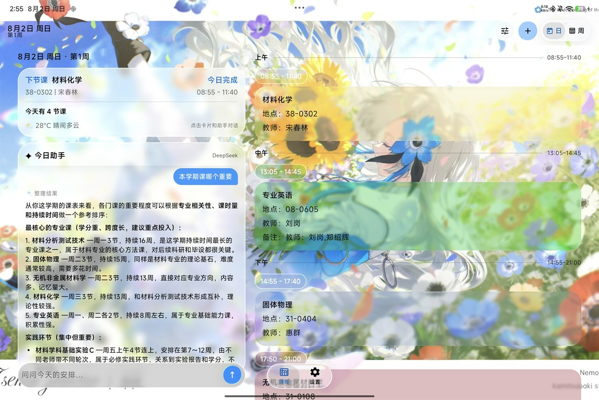
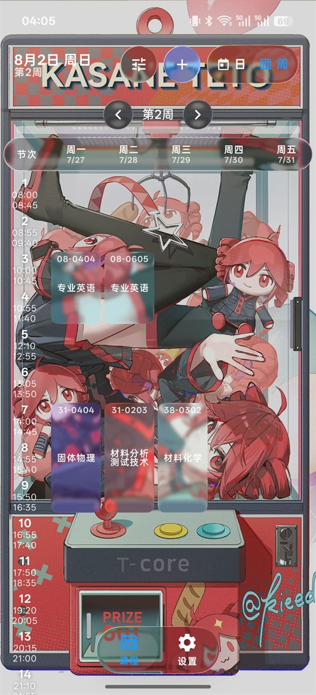
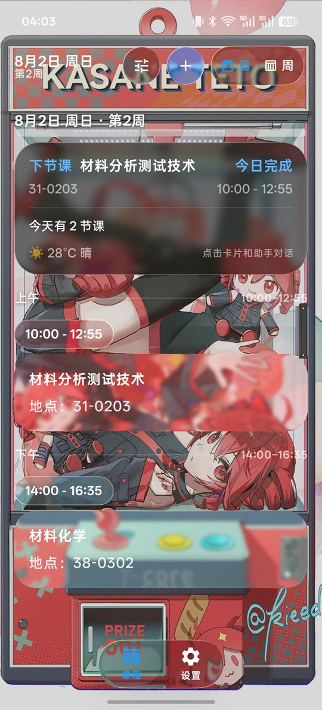
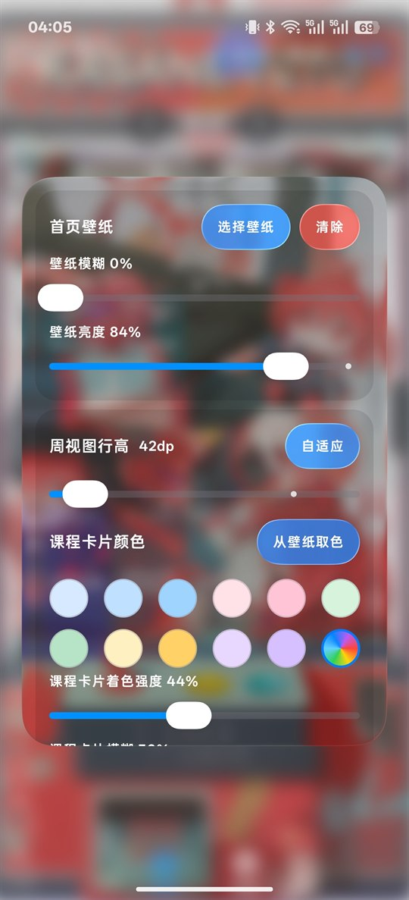
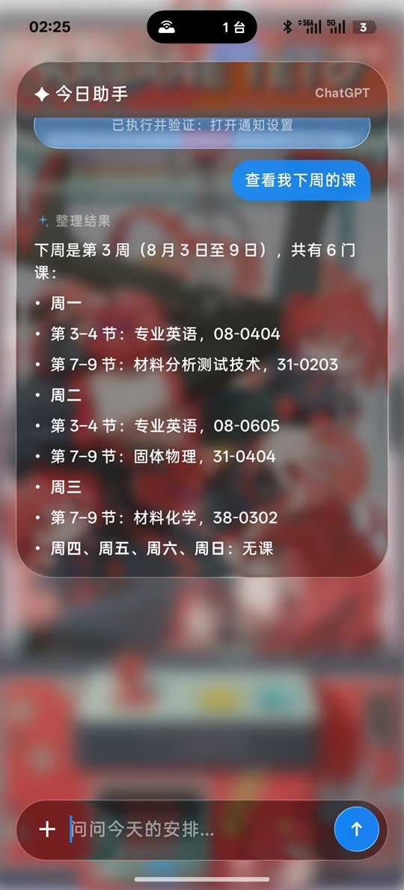
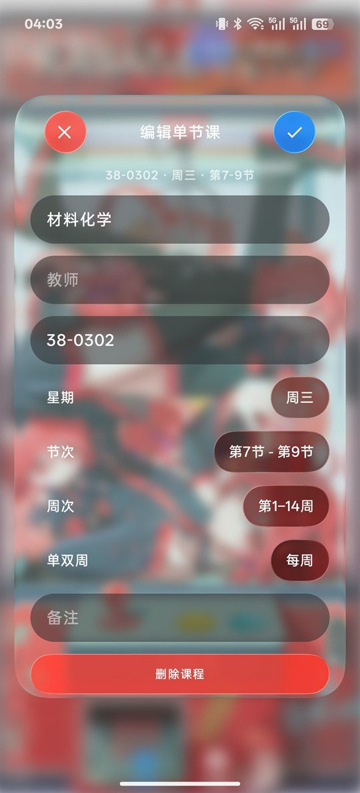
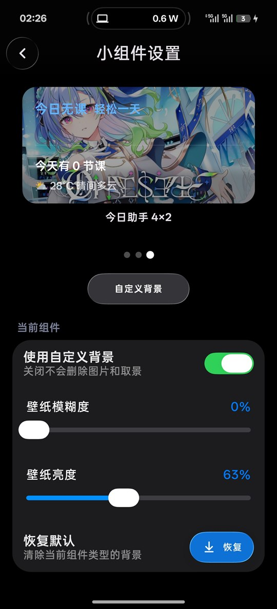
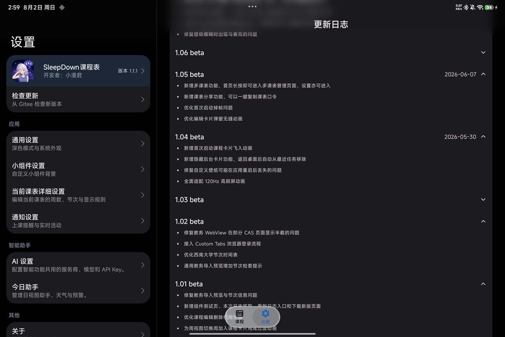

# SleepDown 课程表

> 项目交流群：1108032519

> 一款基于 Jetpack Compose 与 Miuix 构建，融合液态玻璃视觉效果和 AI 能力的 Android 课程表。

> [!IMPORTANT]
> 本仓库是**源码可见项目，并非 OSI 定义的开源项目**。允许个人、非商业地克隆、编译和修改；对外提供任何修改版项目、源码、APK/AAB、应用或服务时，必须至少同步公开可查看/下载的对应源代码，并在发布页面和 App 内显著注明原作者 `xiaomanjun233`、原项目链接及“非官方修改版”，不得冒充原创或官方版本。仅发布二进制、反编译代码、私有/付费/受邀源码或不完整补丁均不符合要求。完整条款见 [SleepDown 署名非商业、源码可见许可 1.1](LICENSE.md)。

SleepDown 是面向日常学习的 Android 课程表：从导入整学期课程，到调整作息、查看当天安排、接收课前提醒，都可以在同一个应用中完成。支持多课表、日周视图、桌面组件和可选的 AI 今日助手；无需注册 SleepDown 账号，课表、设置、壁纸与助手记录默认保存在设备本地。

应用使用 Jetpack Compose 构建，界面以 Miuix 与液态玻璃效果为基础，并针对壁纸背景下的可读性、动画连续性以及手机和平板布局进行了专门适配。视觉效果之外，项目同样重视数据迁移安全、长期存储占用和复杂课表场景下的稳定性。

最低支持 Android 8.0（API 26）。正式身份已迁移到 `com.xiaomanjun.sleepdownschedule`；GitHub 与应用商店发行版共用这一 applicationId。当前正式版与 Beta 以 [GitHub Releases](https://github.com/xiaomanjun233/SleepDown-Schedule/releases) 与 [Gitee 发行版](https://gitee.com/xiaomanjun233/SleepDown-Schedule/releases) 的发布标记为准。

### 正式版、Beta 与厂商实验功能

`main` 是唯一持续维护的应用基线。当前正式版为 `1.2.6`，预发布版本为 [`1.2.7_beta1`](https://github.com/xiaomanjun233/SleepDown-Schedule/releases/tag/v1.2.7_beta1)。Beta 是下一正式版本的逐次候选；每个 Beta 保留独立记录，正式版把仍有效的改动归并成正式日志。下载时按发行页的正式版或预发布标记选择，源码 `main` 不等同于已安装的正式版本。OPPO/一加/realme 流体云、荣耀 YOYO 建议和小米超级岛作为按设备出现的实验功能进入 GitHub 版普通应用，商店版关闭相应实验入口。

早期的 `1.01 beta`—`1.10 beta` 是独立的历史版本序列，不是当前 1.2.6 的 Beta 编号。每一版的更新日志摘要与有证据的时间锚点收录在[最初十个 Beta](docs/EARLY_BETA_HISTORY.md)；无法确认日期或归属的早期画面没有硬配到某一版。

历史 `exp` 分支和 `-expN` 发布保留供追溯，不再作为新功能或独立更新通道。版本、渠道、组件和发布关系见[版本基线](docs/RELEASE_MODEL.md)，厂商能力的隔离边界见[历史实验线记录](docs/EXP_BRANCH_AND_RELEASES.md)。

### 从 1.1.5 迁移

旧包名 `com.example.courseschedule` 下的 v1.1.5 是旧应用身份的最终版本。由于 Android applicationId 机制，新包无法覆盖安装旧包，这是正常现象：

1. 在 v1.1.5 中导出 `.sleepdown` 备份。
2. 安装新包 `com.xiaomanjun.sleepdownschedule`。
3. 在新版本中恢复 `.sleepdown` 备份，并检查课表、设置和提醒。
4. 必要时重新配置 API Key 或教务登录凭据。
5. 确认无误后再卸载旧版本。

备份协议仍为 BackupFormatV1。新版本只接受自身包名或历史包名 `com.example.courseschedule` 创建的备份，未知来源会被拒绝；API Key、Cookie、Session/Access Token 等凭据不会加入普通备份。

## 界面预览

> 演示截图中的个性化壁纸来自 &#64;Rabbit_candy_i 与 &#64;kieed，仅用于展示应用界面效果，版权归原作者所有。如有侵权，请通过仓库 Issue 联系，将及时删除相关图片。

<p align="center">
  
</p>
<p align="center"><sub>平板日视图与内嵌今日助手</sub></p>

<table>
  <tr>
    <td align="center" width="33%"><br /><sub>周视图</sub></td>
    <td align="center" width="33%"><br /><sub>日视图</sub></td>
    <td align="center" width="33%"><br /><sub>液态玻璃个性化</sub></td>
  </tr>
  <tr>
    <td align="center" width="33%"><br /><sub>今日助手</sub></td>
    <td align="center" width="33%"><br /><sub>课程编辑</sub></td>
    <td align="center" width="33%"><br /><sub>桌面组件设置</sub></td>
  </tr>
</table>

<p align="center">
  
</p>
<p align="center"><sub>平板双栏设置页</sub></p>

## 它能做什么

### 课表

支持多课表、日视图与周视图，可按学校安排配置开学日期、总周数和节次时间，并根据日期自动推算当前教学周。课程支持教师、地点、备注、单双周和自定义上课时间；可添加、复制、编辑课程，也可在周视图快速调整某周的安排。

每个课表可保存多套作息方案，并维护调休、停课与补课安排。节次结构调整和课程时间冲突通过对应的预览或确认流程处理。

### 导入

支持手动录入、教务导入、WakeUp/星链等课表口令和 ICS 文件导入，也可使用 AI 从文本、表格、图片或 PDF 整理课程。教务入口复用 [拾光仓库](https://github.com/xingheyuzhuan/shiguang_warehouse) 的适配资源；实际可用学校以应用中的列表和登录结果为准。导入时先检查预览中的课程、周次、节次与开学日期，再确认写入。

AI 导入可选择 OpenAI、DeepSeek、小米 MiMo 或自定义兼容接口，文件类型与图片识别能力取决于所选模型。服务商与模型配置由用户选择。

### 教务自动刷新

支持为课表绑定教务学校与已登录会话，手动刷新或开启周期刷新。可自动刷新的入口通过应用中的连接流程确认；需要网页操作的入口可打开教务页面手动刷新。会话失效后需要重新登录，刷新结果绑定到已选择的课表。

### 提醒和桌面组件

课程提醒支持自定义提前时间，并可在系统支持时通过实时活动展示课程状态与上下课倒计时。实时活动操作按钮可取消当前提醒或手动切换课程勿扰；勿扰需要系统访问权限，厂商实验能力按渠道和设备显示。

提供今日课程与今日助手桌面组件，可独立调整背景、取景、缩放、模糊和亮度。版本检查由用户控制，不会在后台强制下载更新。

### 今日助手

今日助手可查询课程、作息、教学周、调休和多课表信息，结合可选天气回答问题，并协助调整课程及部分应用设置。涉及课程与设置修改时，助手先展示操作计划，经用户确认后执行。对话记录与长期记忆保存在本地；长期记忆可查看、编辑和关闭。

### 外观

首页壁纸支持横竖屏独立取景，课程卡片的配色、透明度、模糊和玻璃效果均可调整。`1.2.7_beta1` 的周视图新增「默认」「全部居中」「从上到下铺满」三种文字排布，地点与教师可独立显示或隐藏。手机与平板采用不同的自适应布局，大屏环境下会重新组织日视图、周视图、设置页和今日助手，而非简单拉伸手机界面。应用图标可固定为浅色或深色，也可跟随系统深色模式切换。

## 基本使用

1. **建立课表**：从首页添加或导入课程；导入时核对预览，也可按需要新建课表保存。
2. **核对学期与作息**：在课表设置中确认开学日期、总周数和节次时间；需要自动教学周时开启日期推算。
3. **查看与调整**：切换日视图查看当天安排，或在周视图切周查看课程；长按课程进入快速编辑，可调整对应周的课程安排。
4. **启用提醒**：在通知设置中开启所需提醒，按系统提示授予通知、精确闹钟及相关后台权限。
5. **按需使用扩展功能**：添加桌面组件，配置个性化外观，或为支持的教务入口连接自动刷新。

AI 功能为可选能力，基础课表可独立使用。启用时选择服务商与模型，并按服务商要求配置 API Key。

> 实时活动的展示能力取决于手机厂商和系统版本。请以设备实际的通知权限、实时活动支持和后台限制为准。

## 数据与隐私

- 课表、设置、壁纸取景和助手记忆使用本地 Room 数据库或应用私有存储保存，不提供云同步。
- 卸载应用可能清除本地数据；重要课表建议保留原始导入文件或自行备份。
- AI 导入、AI 助手和天气功能会把实现该功能所需的数据发送到你选择的服务端；请确认服务商的隐私政策、计费规则和数据处理条款。
- 教务系统登录在 WebView/Custom Tabs 流程中完成；请只在可信的学校站点输入账号与密码。

## 获取项目（仅供学习）

项目在 GitHub 与 Gitee 提供源码入口；当前发布版本以各平台发行页的版本标记为准：

```bash
# GitHub
git clone https://github.com/xiaomanjun233/SleepDown-Schedule.git

# Gitee
git clone https://gitee.com/xiaomanjun233/SleepDown-Schedule.git
```

分发或提供修改版时，必须同步公开对应源代码，使项目至少达到源码可见标准，并遵守许可证中的显著署名、修改说明和非官方标识要求；商业使用须另行取得书面授权。

- `main`：唯一持续开发基线，发布版本由标签固定。
- `develop`、`exp`：历史分支，保留历史记录，不作为新 PR 目标或功能起点。
- `v<版本号>`：正式发布标签，例如 `v1.2.6`；`v<版本号>_betaN` 为逐次 Beta 标签。
- `feature/*`、`fix/*`、`release/*`、`codex/*`：短期开发分支，不作为长期下载入口。

提交改进与 Pull Request 的具体步骤见文末[开发协作](#开发协作)章节。

### 本地构建的 Miuix 依赖

Android 工程通过 composite build 使用官方 Miuix `v0.9.3` 加本仓库补丁。不能直接换成未修改的 Maven 依赖；`Scaffold.underlayModifier`、弹窗表面和内容裁切等接口来自这些补丁，无需另外寻找私人 fork。

在项目根目录执行以下 PowerShell 命令（使用全新的依赖目录，不要在已打旧补丁的目录重复应用）：

```powershell
git clone --branch v0.9.3 --depth 1 https://github.com/compose-miuix-ui/miuix.git ../miuix-reference
$miuixPatchRoot = (Resolve-Path ./patches).Path
git -C ../miuix-reference apply "$miuixPatchRoot/miuix-0.9.3-sleepdown.patch"
git -C ../miuix-reference apply "$miuixPatchRoot/miuix-cascading-popup-surface.patch"
git -C ../miuix-reference apply "$miuixPatchRoot/miuix-scaffold-underlay.patch"
git -C ../miuix-reference apply "$miuixPatchRoot/miuix-compact-dropdown.patch"
git -C ../miuix-reference apply "$miuixPatchRoot/miuix-popup-slide-feedback.patch"
git -C ../miuix-reference apply "$miuixPatchRoot/miuix-popup-hover-layout.patch"
git -C ../miuix-reference apply "$miuixPatchRoot/miuix-cascading-anchor-morph.patch"
$miuixSourceRoot = (Resolve-Path ../miuix-reference).Path
.\gradlew.bat assembleGithubDebug "-Psleepdown.miuixSourcePath=$miuixSourceRoot"
```

先在 Android Studio 配置 Android SDK 与 Gradle JDK。命令行 `sleepdown.miuixSourcePath` 会覆盖本地配置中的路径；Release 签名需自行配置，不随源码分发。补丁基线、范围和验证说明见 [patches/README.md](patches/README.md)。

## 项目结构

```text
CourseSchedule/
├── app/
│   ├── src/main/java/com/xiaomanjun/sleepdownschedule/
│   │   ├── app/                             # 应用装配、启动、顶层状态与页面宿主
│   │   ├── model/                           # 跨功能共享模型
│   │   ├── data/{local,repository}/         # Room、迁移、DAO 与 Repository
│   │   ├── domain/{course,schedule}/        # 无 UI 副作用的课程与课表规则
│   │   ├── core/                            # 身份、配置、性能、壁纸与通用 UI
│   │   ├── feature/                         # Home、导入、设置、组件等纵向功能
│   │   ├── glass/                           # 液态玻璃框架及 UI 适配
│   │   ├── transition/{legacy,...}/         # 统一转场与既有 Legacy renderer
│   │   └── *.kt                             # 稳定 Android 入口与兼容门面
│   ├── src/main/assets/shiguang_warehouse-main/
│   │                                        # 教务系统适配资源
│   └── src/test/ / src/androidTest/          # 单元测试、迁移和仪器测试
├── benchmark/                                # Macrobenchmark 与 Baseline Profile
├── docs/                                     # 版本说明、性能基线和节次方案文档
├── patches/miuix-0.9.3-sleepdown.patch      # Miuix 基础组合构建补丁
├── patches/miuix-cascading-popup-surface.patch
│                                           # 级联菜单玻璃表面扩展
├── patches/miuix-scaffold-underlay.patch     # 页面采样层与弹窗宿主分离
├── patches/miuix-compact-dropdown.patch      # 下拉菜单局部紧凑排版接口
├── patches/miuix-popup-slide-feedback.patch  # Popup 滑动选择与交互材质接口
├── patches/miuix-popup-hover-layout.patch    # Popup 悬停级联、长列表与紧凑排版
├── patches/miuix-cascading-anchor-morph.patch # 模型选单复用设置 Popup 锚点动效
├── THIRD_PARTY_NOTICES.md                    # 第三方代码与许可声明
└── gradlew / gradlew.bat                     # Gradle Wrapper
```

完整的包边界、入口映射与安全拆分规则见 [`docs/architecture/PROJECT_STRUCTURE.md`](docs/architecture/PROJECT_STRUCTURE.md)；通用界面复用约束见 [`SLEEPDOWN_DESIGN_SYSTEM.md`](docs/architecture/SLEEPDOWN_DESIGN_SYSTEM.md)，今日助手工具与提示词链路见 [`DAY_AGENT_RUNTIME.md`](docs/architecture/DAY_AGENT_RUNTIME.md)。

## 技术栈

| 类别 | 主要实现 |
| --- | --- |
| UI | Jetpack Compose、Material 3、Miuix |
| 数据 | Room、KSP、Kotlin Serialization |
| 图形 | `kyant/backdrop`、自定义玻璃与动态模糊管线 |
| 导入 | Android WebView / Custom Tabs、PDF Renderer、ICS 解析 |
| 通知 | Alarm、Foreground Service、实时活动兼容逻辑 |
| 桌面组件 | RemoteViews |
| 性能 | Macrobenchmark、Baseline Profile |

## 第三方项目与许可证

- [Kyant0/AndroidLiquidGlass](https://github.com/Kyant0/AndroidLiquidGlass)：液态玻璃目录组件基础，Apache-2.0。
- [compose-miuix-ui/miuix](https://github.com/compose-miuix-ui/miuix)：设置和教务导入页面组件，Apache-2.0。
- [xingheyuzhuan/shiguang_warehouse](https://github.com/xingheyuzhuan/shiguang_warehouse)：教务系统适配资源，MIT。
- AndroidX、Jetpack Compose、Kotlin Serialization 等依赖遵循各自许可证。

本项目对第三方代码的引用和修改范围见 [THIRD_PARTY_NOTICES.md](THIRD_PARTY_NOTICES.md)。

## 开发协作

本项目部分代码分析、实现、测试与文档整理由 OpenAI Codex 协助完成，最终内容由项目作者审阅并发布。

### 分支约定

- `main`：唯一持续维护的代码基线，也是普通改动的 PR 目标。
- `develop`、`exp`：只保留历史；不再从它们派生普通功能或向它们持续同步。
- `v<版本号>`：正式发布版本标签，例如 `v1.2.6`；Beta 使用独立预发布标签。
- `feature/*`、`fix/*`、`release/*`、`codex/*`：短期开发分支，不作为长期下载入口。

### 如何提交 Pull Request

欢迎提交问题反馈或代码改进。本项目并非完全开源，参与贡献前请阅读 [LICENSE.md](LICENSE.md)，确认你的改动符合署名非商业、源码可见许可，且不包含未经授权的第三方素材。

完整步骤、构建环境和验证要求见 [贡献指南](CONTRIBUTING.md)。外部贡献从最新 `main` 创建 Fork 分支，PR 目标选 `main`，按模板说明问题、修改与实际验证；没有强制标题格式、分支前缀或 Issue 编号。

维护者继续使用现有主分支协作方式和管理员权限。PR 自动检查用于提供反馈，纯文档改动跳过 Android 构建；新增检查经过验证后再决定是否作为合并条件。

## 许可证

本项目采用 [SleepDown 署名非商业、源码可见许可 1.1](LICENSE.md)，**不是 OSI 定义的开源软件**。

- 允许：个人、非商业地查看、克隆、编译、修改，以及在满足许可条件时分发修改版。
- 源码可见：任何对外提供的修改版项目、源码、APK/AAB、应用或服务，都必须同步公开足以检查和合理重建该修改版的对应源代码；公开 GitHub、Gitee 或同等公开仓库/页面均可。仅发布二进制、反编译代码、私有/付费/受邀源码或不完整补丁不符合要求。
- 修改版分发：必须在发布页面和 App 内显著注明“基于 SleepDown 修改”、原作者 `xiaomanjun233`、原项目链接和主要修改内容，并明确其不是官方版本。
- 禁止：移除或弱化署名、冒充原创或官方版本、使用易混淆的名称/包名/图标，以及未经授权的商业使用。
- 其他用途：必须事先取得项目作者的明确书面授权。

仓库中的第三方代码和资源继续遵循其原始许可证，详见 [THIRD_PARTY_NOTICES.md](THIRD_PARTY_NOTICES.md)。
