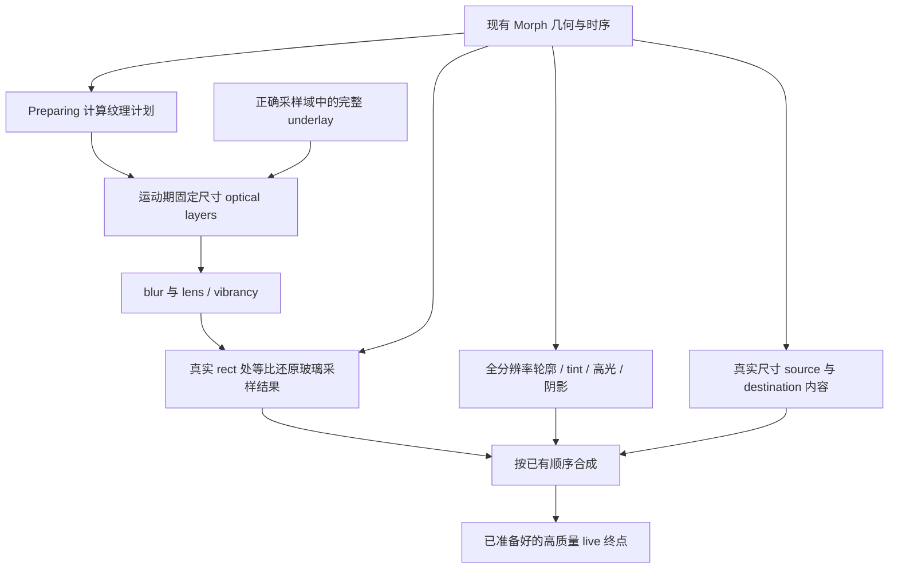

# Morph 渲染减负设计：固定纹理预算，保留真实几何

日期：2026-09-05。状态：设计提案，尚未实现、编译或实机验证。

代码核对基线：`e0883b691b9b46497531872c6fb9f3f0f88b41cd`（GitHub `main`）。本 PR 只提交本文；工作目录中其他分支的未提交修改不属于方案基线。与现有 [玻璃框架](LIQUID_GLASS_FRAMEWORK.md)、[项目边界](../architecture/PROJECT_STRUCTURE.md) 配套阅读。

## 1. 当前 Morph 为什么贵

提供的平板调查中，主线程多数时间在 `syncAndDrawFrame → postAndWait` 等待；慢帧同时出现 RenderThread `flush layers`、Vulkan allocation / submission 和大纹理 upload，而对应重组和测量很小。这支持优先调查 GPU 资源与提交路径。这里没有重新采集原始 trace：76 ms flush、fixed-shell 的历史改善、动态 blur 的退化均为用户提供的历史证据，不能视为本方案的新基线或收益。

渲染成本应拆成四项：

1. **尺寸与资源失效**：带效果或需要组透明度的 layer 尺寸改变，可能使已有离屏 surface 不适用。申请新 surface、初始化、重绘，以及仍被在途帧引用的旧 surface，共同制造峰值。位移本身通常比改变这类 layer 的尺寸便宜。
2. **重复处理大面积像素**：blur 的中间结果、折射采样、清晰和模糊内容、父级组透明度可叠加多个阶段。即使分配稳定，每帧读写同样的大纹理仍昂贵。
3. **保留图与提交成本**：多级 RenderNode、子层重放、image filter 和脏区域传播增加遍历及提交工作。单个 AGSL 函数变短，并不一定减少这些工作。
4. **交接峰值**：预热、首次曝光、终态 live 内容和关闭前重新录制，可能让旧／新资源短暂共存。只量 Opening 中段会漏掉点击延迟和最后一帧卡顿。

`GraphicsLayer` 首先是绘制指令／属性的保留边界，不应把每个节点都算成一张纹理。Compose `Auto` 在组 alpha 小于 1 或设置 RenderEffect 时会进入离屏路径；换成 `ModulateAlpha` 对重叠内容可能改变合成结果，设置 RenderEffect 也仍需要离屏。不能用机械删除 layer 或替换合成策略推断等价收益。[Android Graphics modifiers](https://developer.android.com/develop/ui/compose/graphics/draw/modifiers)

`RenderNode` 可以重放绘制指令，并不提供“锁住某块 Vulkan 纹理永不重分配”的应用层承诺。`flush layers` 是 CPU 侧 trace 区间，不等于 GPU 实际执行时间；阻塞、驱动提交和 GPU 工作应结合线程调度、fence、FrameTimeline 及设备可用的 GPU 数据解释。`texture upload` 也不能仅凭名字一一归给某个 Compose layer。[RenderNode API](https://developer.android.com/reference/android/graphics/RenderNode)

### 大屏数量级

3200 × 2136 = 6,835,200 像素。一张紧密排列 RGBA8888 图像为 27,340,800 bytes，即 27.34 MB / 26.07 MiB。四张就是约 104.30 MiB，尚未包含行对齐、效果 padding、blur 临时结果、在途帧或窗口缓冲区。RGBA_F16 按 8 bytes/pixel 另算。

只作为数量级：一个全屏 pass 每像素读写各一次、连续 120 fps，就约为 6.56 GB/s 的理论流量。实际 blur 多次采样、cache、压缩、tile GPU 和驱动会改变数值，不能把这个乘法当成测得的显存带宽。

## 2. 仓库中的实际路径与诊断盲区

| 代码位置 / 符号 | 已核对行为 | 对设计的影响 |
| --- | --- | --- |
| `glass/GlassTransitionLayer.kt`：`sampleGlassTransitionEnvelope`、`stableContentOffsetInEnvelope` | 采样轨迹、固定外层尺寸、动画 inset outline、目标内容真实尺寸居中 | 保留坐标及几何工具；不把固定包络当成优化已经完成 |
| `feature/home/overlay/HomeMenuDestinationOverlay.kt`：`HomeMenuDestinationTransitionShell` | stable 分支替换外层 clip；内部目标内容仍按 target size 布局 | 不恢复已经否决的 source / destination 非等比缩放 |
| 同文件：`LiquidPanel` 和 `HomeAddMenuMorphPanel` | 目标玻璃按最终尺寸绘制；源菜单仍传入动态 `targetSizeProvider` | 外壳稳定不证明内部所有昂贵层稳定；源菜单是后续单独归因对象 |
| 同文件：`destinationContentLayer`、`showBlurredDestinationContent` | 运动期重放目标内容；独立固定半径 blur 分支；Open 直接绘制 live 内容 | 已录制 GraphicsLayer 不等于无子层重绘的像素快照；保留 sharp / blur 的既有视觉配比 |
| `glass/GlassInsetLens.kt`：`insetRoundedRectLens` | 已有固定 envelope 内动态 rect/radius 的官方公式派生 SDF | 可复用已验收的坐标语义；菜单路线并未自动改用该 SDF |
| `glass/GlassSampling.kt` | 课程卡已有 backdrop/effect 与全分辨率 decoration 分离 | 复用这种职责分离，不复制课程数量阈值给 Morph |
| `glass/LiquidMorph.kt` | Movement 与 Session 资源、立即返回、配置替换、代次清理 | 继续使用现有 controller，不再建第二套转场状态机 |
| `SleepDownGlassSurface.kt` / `GlassSceneState.kt` | rebuild 在 `DisposableEffect` 结构键变化时记录；面积在 consumer draw 时累计 | 现有 counters 是应用层代理指标，不是底层分配账本 |

上述路径均相对于 `app/src/main/java/com/xiaomanjun/sleepdownschedule/`。基线菜单打开／关闭分别为 330 / 350 ms；本方案不更改这些曲线和时间。

必须避免三种误判：

- `LayerSizeChanges == 0`：只说明被记录的 consumer 尺寸未改变；不覆盖所有父 clip、source、destination 和 HWUI filter 中间层，也不记录首次分配。
- `EffectChainRebuilds == 0`：只说明当前框架结构键没有触发登记；不能证明 Android RenderEffect、native filter、shader program 都没有重建。
- `OffscreenPixels`：是区间内 consumer 绘制面积的累计代理值，包含重复 draw；不是同时驻留像素，也不是 GPU memory。`ConsumerLayers` 同样是有绘制记录的 descriptor 数，不是 RenderNode 总数。

## 3. 选定架构

选择 **运动期固定预算的玻璃采样层 + 原尺寸内容层 + 原分辨率装饰层**。继续由 `glass/` 持有 renderer，由现有 Morph controller 驱动。首先使用 Compose GraphicsLayer / Backdrop 已有能力；不引入独立 Surface、Vulkan renderer 或跨 Activity 的新转场框架。



图中的箭头是数据／绘制关系，不是保证一条箭头对应一个 GPU pass。blur 仍可能需要内部阶段；“融合”只在减少实际图节点、临时像素和提交时有价值。

### 3.1 真实几何与纹理容量分别表达

每个运动段准备一个不可变 `OpticalPlan`（设计名，尚未新增 API），包含：

- route / session generation、采样域与窗口坐标变换；
- 现有 opening/closing rect 轨迹所需的输出包络；
- 按该路线现有 lens 坐标、blur 支持区域、最大折射位移计算的 capture bounds；
- optical sample scale、实际整数宽高、预估峰值像素和字节数；
- 材质结构键、输入内容代次和可用的原分辨率终点。

逐帧只更新当前 rect、radius、位置、现有材质动态量及 alpha。内容继续按原路线测量：目前菜单是 target size 布局后居中裁切；需要真正 remeasure 的其他路线也不能以缩放替代布局。圆角在真实像素空间定义，不能从最终页面 `scaleX/scaleY` 推导。

Stable Envelope 保留为容量候选，不再与光学分辨率绑定。对于教务全屏，其输出面积接近窗口，这是几何事实；通过缩小 optical 纹理降低代价。初版不按每帧 rect 裁出大小不同的纹理，也不使用沿途换档导致重分配的动态分辨率。

包络采样不能证明连续曲线绝不越界。复用现有像素对齐，保留含 opening/closing 的高密度几何检查；对曲线极值和 rounding 提供保守边界。诊断逐帧检查越界，越界需修正 plan，不能静默裁掉轨迹。以后若变更 spring 或允许超调，必须重新验证界限。

### 3.2 先降低光学采样面积，不降低内容质量

只将 backdrop / blur / lens 渲染到等比缩小的固定目标，之后以同一个 `1/s` 等比还原。全分辨率文本、图标、触控、语义、tint、边缘和装饰沿用原坐标与绘制顺序。这里的等比采样还原不会压缩真实内容布局。

令输出位置为根坐标 `p`、capture 原点为 `o`，采样坐标为 `q = s × (p - o)`。rect、圆角、blur 半径、lens height / amount 及 padding 均使用同一个比例转换；百分比、颜色和无量纲强度不乘比例。沿用既有根层逆变换与跨窗口补偿，不能同时手工换算和再次套用 Backdrop 的逆矩阵。

整数分配使用 `ceil(sW)` / `ceil(sH)`；逻辑矩阵始终用同一个 s，多出的边界像素裁掉。不能用两个独立的实际宽高比还原，否则 rounding 也会引入轻微非等比畸变。

初始实验只比较 `s=1` 和 `s=0.5`，明确不是正式质量常量。后续按最高可接受质量从 `{1, 0.75, 0.5}` 选档，依据 expanded capture area、同时存活的 optical 层、像素格式、边缘采样误差及纹理维度限制，在 Preparing 选定后锁定。小场景可留在 1；不能按机型、DPI 或课程数量写特例。

| 3200 × 2136 无 padding 的示例 | 纹理尺寸 | 每张 RGBA8888 | 相对像素面积 |
| --- | --- | --- | --- |
| 1× | 3200 × 2136 | 26.07 MiB | 100% |
| 0.75× | 2400 × 1602 | 14.67 MiB | 56.25% |
| 0.5× | 1600 × 1068 | 6.52 MiB | 25% |

实际计划必须按 padding 后尺寸计算。例如三个半分辨率 optical 阶段约为 19.56 MiB，但这不包含 destination、原有 provider、窗口缓冲及驱动开销。若仍有三张全分辨率目标内容纹理，不能宣称“总显存降低 75%”。

申请前按 `Σ(width × height × bytesPerPixel)` 枚举已知同时存活层，含终点交接重叠；运行后用实机峰值校正未知 HWUI 中间层。预算参数由 P0/P1 数据确定，不能把理论字节数当成硬件保证。不满足预算或视觉资格的路线在运动开始前选择现有 renderer，并记录具体原因；不能运动中循环创建、降档、重试。

### 3.3 capture、blur、lens 的组织

首个原型保持 **live input 和现有采样域**，只缩小 optical 输出，便于归因。已有 Background / Content / PickerScene / DialogBridge 的边界不变。最终输出 host 不得进入自己的 provider；页面正文也不能意外成为 shell backdrop 输入。

接着才调查保留结果：

1. 相同域、内容代次、capture bounds、坐标变换、像素格式和分辨率下，复用可复用的输入。
2. 固定 blur 参数时优先保留稳定的 blur 阶段，再将当前几何用于 lens。背景真的变化时必须更新，不能把光标、异步学校列表或其他动态 underlay 误判成静态。
3. 只对已经有冻结背景语义的运动路线沿用冻结；本方案不新增长时间冻结，不改课程卡遮挡／恢复路线。
4. `GraphicsLayer.record` 只是绘制指令的录制边界；其中引用的 child layer 可能继续失效。是否留住像素结果、是否仍重放整棵树必须看 trace，不能用一个 `recorded=true` 推断。

按现有顺序保留 blur、vibrancy、lens / 色散和 tint。对可融合的逐像素运算，后续可在同一 runtime shader 中计算 SDF 与折射；blur 的邻域访问不因为写进一个字符串就免费。初版不写全屏大半径、多重动态循环的 AGSL blur，也不把低成本 tint 搬入昂贵中间层。

特别是菜单的目标 LiquidPanel 当前采用目标布局坐标的 lens，再由外层 Morph 裁切；直接改成当前 Morph rect 的 lens 会改变光学外观。P1 必须保留原路线的 lens 坐标。个性化已有 inset SDF 的路线才保持 inset 语义；将菜单改成真实移动边界折射应作为独立视觉提案，不能隐藏在性能改动里。

blur 输入应先留足采样边缘，输出才按真实 shape 裁切。不能先将输入裁成当前 rounded rect 再 blur，否则边缘会吸入透明黑／产生 halo。窗口外像素使用与原实现一致的 tile mode；padding 要按实际滤镜支持范围和最大折射位移验证，不能把 envelope 的 2 px 几何 guard 当成 blur padding。

### 3.4 稳定效果结构的可实现边界

固定结构键可包括算法版本、色散变体、child input 个数及必要颜色空间路径；rect、radius、动态深度等是帧数据。保留 RuntimeShader 程序实例有助于避免重复创建，但仍需让当前 uniforms 正确参与当帧绘制。

Android `createRuntimeShaderEffect` 将所在 RenderNode 内容绑定到指定 shader input，API 33 起可用；不能据此假设任意两个 GraphicsLayer 能直接作为两个 shader child 输入。[RenderEffect API](https://developer.android.com/reference/android/graphics/RenderEffect)

`setFloatUniform` 支持更新 shader 参数，但本提案不假定创建过的 RenderEffect 会在所有目标系统上自动读取后续修改。P0 必须验证 retained RenderEffect、重新绑定 effect、draw-time Paint shader 等实际路径的帧更新、native 对象创建和图像正确性。若必须产生新的 filter 快照，就如实记录；仍可保留程序与固定纹理计划，不以“零 Java 分配”代替画面更新。[RuntimeShader API](https://developer.android.com/reference/android/graphics/RuntimeShader)

不复用一个可变 RuntimeShader 实例服务多个同时绘制的独立消费者，以免 uniforms 串帧。Haze 的 renderer-owned runtime、缓存和显式生命周期提供了可参考的职责划分，但其性能数字不能移植为 SleepDown 收益，也没有理由为此替换现有 Backdrop。[Haze architecture](https://chrisbanes.github.io/haze/dev/architecture/)

### 3.5 全分辨率边缘与内容

保持现有圆角 clip，直到单独的 clip 实验证明新的边界实现等价且更快。光学贴图的低分辨率边界之外仍由全分辨率轮廓裁切／装饰，不扩大低分辨率锯齿；SDF 边缘过渡宽度需换算到真实像素。不同圆角风格不能一律替换为普通圆弧 SDF。

source / destination 在真实尺寸下移动和裁切。内容的 sharp / fixed-blur 混合、层序及 alpha 保持原实现。先不改 destination snapshot，不以动态 BlurEffect 半径重复已经失败的实验，也不增加多档全屏 blur atlas。

后续若 trace 证明 destination blur 分支占主导，单独评估只降低这个已模糊分支的采样面积；sharp 文字继续原分辨率，半径按 s 转换。目标是减少一个明确分支的像素负担，并非增加一张缓存图来掩盖原来的图。

融合 sharp / blur 需要合法的多输入来源、透明度与颜色空间等价性证明；不能用不存在的 `GraphicsLayer → shader` 转换伪代码承诺单 pass。对重叠半透明内容，现有两次 SrcOver 与简单 `mix(sharp, blurred, t)` 不一定等价。

## 4. Opening、Closing 与终态交接

继续使用现有状态和 generation，不延长动画曲线，不增加全局 idle 纹理池。

| 阶段 | 资源与绘制约束 |
| --- | --- |
| Preparing | 在实际窗口和采样域准备固定 plan；预热真实会使用的路径；记录点击到首帧。alpha=0 或离屏不保证 GPU 执行，不能仅以组合完成宣布预热成功 |
| Opening | 固定 optical 尺寸和档位，按原轨迹更新真实 geometry；目标内容保持原尺寸；任何输入变化依照代次更新 |
| 接近 Open | 将原有高质量 live 路径准备好。转场末帧和 live 首帧的 rect、位置、圆角、颜色与输入代次对齐 |
| Open | 全分辨率正常交互；从绘制树移除运动分支，清除运动 RenderEffect／clip 的引用并释放 Movement 资源；全屏不保留额外 Morph clip |
| Open → Closing | 读取当前表单、学校列表、滚动位置和当前窗口，重新准备关闭用内容；不能重放 Opening 旧快照；原高质量当前帧保持可见直到关闭输出可用 |
| Closing | 使用当前关闭轨迹和同一运动段内固定 plan。只在既有交接点交回来源；不改变课程卡背景恢复节奏 |
| Released / cancel / configuration change | exactly-once 解除旧代次资源；旋转／分屏按既有状态交接到新配置，不把旧分辨率图片拉伸成新窗口 |

降采样到原分辨率可能发生质感跳变。先保留原交接时间，比较纹理差异；需要混合时，只对光学结果在既有末段做短且有预算的重叠，文字不参与。该交接改动是单独实验，不能未经验证随 P1 上线；若固定档位无法在既有时序内无缝交接，该档位不合格。

同一 renderer 的透明度变化、blur 动态变化及输入滤镜顺序必须保持连续；不能仅验证 rect 连续。GPU 的释放可能延后到在途帧完成，因此 `StableResourceLeaks=0` 只是应用所有权检查，仍要看窗口稳态和重复开关后的 native / GPU 内存趋势。

打开中立即返回应从当前几何和光学状态反转，沿用现有反向时序；复用当前已准备资源，不重新从完整源点开始。Preparing 尚未完成时按现有取消路径退出；异步回调携带 token，不能让旧代次交接到新页面。关闭后重新打开则创建新资源代次。

## 5. 主要收益与新增风险

| 方案 | 预期收益来源（待测） | 风险与验证 |
| --- | --- | --- |
| 固定运动期 optical 尺寸 | 降低不同尺寸 surface 的申请、初始化和短时共存 | 稳定大 envelope 仍可过大；核对 expanded bounds 与内存峰值 |
| 等比降低 optical 分辨率 | 按 s² 降低这一部分的像素读写、filter 工作和潜在临时存储 | 背景细线、折射色边及小半径会软化；全分辨率装饰不能掩盖所有质感变化 |
| 输入代次与固定 blur 结果复用 | 降低真实静态输入上的重复处理 | retained layer 不等于 immutable image；动态 child 可能继续遍历 |
| 稳定 shader 程序／结构 | 减少程序和 filter graph 的无意义重建 | uniform 不刷新、多个 consumer 串参、native snapshot 成本仍可能存在 |
| 全分辨率 content 与光学分离 | 内容几何和可读性保持正确；避免给整个正文附加 optical filter | alpha／clip 仍可能产生全尺寸离屏层，不能提前承诺纹理总数 |
| 有预算的终点交接 | 避免一次性暴露尚未准备的 live 重层 | 预热会占用前几帧 GPU，重叠会增加峰值；点击和关闭延迟必须一起计入 |

不选择自建 RenderNode compositor 作为第一步：Compose 已经走相关系统保留渲染路径，单纯改 API 不绕过 HWUI / Vulkan。独立 HardwareRenderer / HardwareBuffer / Surface 会新增 fence、线程、颜色空间、生命周期和窗口合成边界；只有 P0–P3 证据说明现有 API 无法消除明确瓶颈，才值得单独原型。

不选择按当前 rect 高频换小纹理：它重新引入连续分配。不先做多 tile：增加 filter halo、接缝、重叠采样及 submission；对最终全屏场景未必优于一个受预算限制的低分辨率 optical 区域。

API 33 以下保留当前项目对应能力路径；不把 RuntimeShader 支持当成应用启动前提。后台／暂停和 memory trim 清理可重建的运动缓存，通过当前路线恢复；不捕获 OOM 后递归重试。屏幕方向、字体比例、分屏、宽色域输入、透明背景与安全区均进入验收矩阵。

## 6. 最值得先做的原型

所有变体从同一已锁定基线分出；开关仅放 benchmark 构建，正式策略不变。以下是待实施步骤，不是已完成记录。

| 次序 | 有界改动 | 要回答的问题 / 停止条件 |
| --- | --- | --- |
| P0a：诊断校准 | 给 source、shell、optical、destination sharp/blur 加稳定实例 ID 和生命周期记录；不改视觉 | 大纹理和 rebuild 到底来自哪里？没有归因先不改全框架 |
| P0b：shader 更新小原型 | 固定目标中动画 rect/radius，分别测试 retained / rebind 路径 | 目标系统是否正确更新 uniforms？若冻结或 native 重建昂贵，不宣称 graph 稳定 |
| P1：教务 optical 分辨率 | 仅菜单→教务的目标玻璃 sample scale 从 1 改 0.5；保留 stable envelope、live input、源菜单、内容缓存、时序和层序 | optical pixels 下降是否伴随 flush / overrun 改善？若 destination 主导而无收益，记录并转向 P3 |
| P2：保留结构或 blur 结果 | 基于 P0 发现，每次只做 shader 结构复用或固定 blur 阶段复用之一；分开提交／测试 | 相同像素预算下能否减少图重建或重复处理？不再叠加新分辨率变化 |
| P3：destination blur | 仅在它被证实是主因时减少该分支采样面积，原尺寸 sharp 和相同混合不变 | 全屏内容分支的改善是否超过可见清晰度／交接退化？ |
| P4：交接与推广 | 单独验证 movement → live 光学交接，再逐条推广 Add、Manual、个性化 | 开／关与第一张 live 帧都合格，才扩大 allowlist |

若 P0a 表明动态 source 是主要分配源，则在 P1 后单开 source-only 固定容量实验，使用真实尺寸源内容与原 outline；不能同时更换目标缓存和源渲染。首个可评审代码 PR 应只包含一种实验变量、必要诊断和记录文档。

## 7. 可执行的 A/B 验证协议

### 固定输入与构建

- A 为当前 `main` 的已验收路径（包括现有 Stable Envelope），不是历史 fixed-shell；B 为同一 commit 加一个实验变量。记录两者 commit、APK SHA-256、依赖版本、R8/资源压缩/编译模式和 instrumentation 版本。
- 首轮用现有 `HomePopupAndPageTransitionBenchmark#eduImportPageWithoutCompilation`：相同 `CompilationMode.None()`、WARM 启动、壁纸与数据；比较 Add / Manual 时复用对应方法。之后单独增加 `CompilationMode.Partial` 组，不能混算。
- 现有测试只有打开和 800 ms 观测窗口、默认五轮，不覆盖关闭。正式对照需增加 close journey 和立即返回／重复开关 journey，保持 UI tag 和点击位置解析方式一致。
- 设备优先 Android 16、3200 × 2136 小米平板；记录实际刷新率、方向、density、字体比例、系统 build、GPU/driver、温度和供电状态。网络学校列表使用相同已就绪数据条件，避免将请求延迟混入渲染结论。
- 不在应用中强制刷新率。由相同设备条件分别检查实际 60 / 120 Hz；预算为 16.67 / 8.33 ms，不能把 120 Hz peak 当作每帧实际期限。
- 设备安装和自动操作按项目授权要求执行；PLJ110 的历史暂停不能从旧日志中的安装记录推导为本任务的新授权。本设计 PR 不运行设备操作。

### 轮次与统计

1. A / B 各做独立冷首次进入，保留 shader／纹理首次使用代价。
2. 热测试每组两次准备循环，随后至少十次有效开关；按 A-B-B-A 顺序跑两轮，避免温升和 cache 顺序偏差。达到相同热状态后继续；发生系统打断则标注失效原因，不删除慢帧来美化结果。
3. 每次保存原始 trace 和 benchmark JSON，按**每次 journey**生成摘要，再比较组间分布。P99 在约几十帧的单次动画中很不稳定，同时报告最差帧和超时帧数；有差异时增加独立 journey，而不是只挑代表帧。
4. 视觉录屏和带重诊断的 trace 分开采集，避免录屏改变 GPU 负载。另跑相同发布配置、无额外重诊断的 FrameTiming 对照。

### 分阶段窗口

同一 trace 中必须明确标识：点击→首张变化帧、Preparing、Opening、Open 首几帧、稳定 Open、请求返回→首张关闭帧、Closing、Released 后恢复。每个标记附 route 和 session generation；不记录用户内容。

已有标签不足的阶段在 P0 增加诊断 trace section。只用固定 800 ms 窗口看总量会把稳定帧稀释进动画结果；但也必须保留完整点击到交接的总成本，防止把工作搬到 Preparing 就宣称优化。

### 指标与解释

| 层面 | 记录项 | 成功证据 |
| --- | --- | --- |
| 用户可见 | CPU frame duration / frame overrun P50、P90、P95、P99，missed deadline 数，最差帧，首响应与交接延迟 | 教务开关尾部改善，且未把延迟搬到首帧或终点 |
| RenderThread | `flush layers` 的 per-journey sum、最差区间、阶段分布；线程 running / blocked；提交调用 | 大幅等待或处理区间减少；不把主线程和 RenderThread 等待相加成总 GPU 时间 |
| GPU / 驱动 | 可用的 allocation、texture upload、submission、fence / GPU slices；按尺寸与阶段归类 | 对应变量的实际分配／上传／像素工作减少，不能仅凭 counter 推断 |
| 内存 | 稳定 Home、Preparing 峰值、Open、Closing 峰值、Released 后的 native / graphics / 可用 GPU 统计 | 重复循环不持续增长；终点重叠没有抵消节省 |
| 现有 Glass counters | 全部十项，与对应阶段和域对齐 | 无意外 provider / consumer 增长，已观测尺寸稳定，像素代理下降，稳定态登记泄漏为 0 |

GPU driver 的某些事件和显存指标可能未开放；缺失必须写“不可观测”，不能用 `dumpsys meminfo` 的某列冒充精确 GPU allocation。GPU completion 与 CPU submission 分开报告。

现有 counter 按完成帧区间重置；先对齐实际样本／帧，不按绘图软件插值后的时间积分，也不对“每帧面积”和“同时驻留面积”混算。应用级 P0 拟新增以下观测点，名称明确与现有代理指标分开：

- `SleepDown.Morph.LayerCreates / LayerReleases / LayerResizes`：应用掌控的实际资源申请／释放／宽高 setter 边界，包含首次申请；不等同 Vulkan allocation。
- `SleepDown.Morph.ShaderProgramCreates / NativeEffectCreates / UniformUpdates`：实际工厂调用和更新入口，不从 composition 推断。
- `SleepDown.Morph.OwnedPixelBytes`：按已知活跃资源、像素格式计算的 gauge，包含所有权重叠，明确排除未知 HWUI 中间层。
- `SleepDown.Morph.InputRecords / DestinationRecords / Handoff`：记录阶段、域、代次和资源 ID，查明重录来源。

首先确认 trace 中真实 slice 名称和所在进程／线程，再选择查询条件。下面的 Trace Processor SQL 可用于发现目标进程 RenderThread 的候选 slice；不假定厂商使用统一 Vulkan 标记，也不把嵌套父子区间相加：

```sql
SELECT p.name AS process_name, t.name AS thread_name,
       s.name AS slice_name, COUNT(*) AS samples,
       MAX(s.dur) / 1e6 AS max_ms
FROM slice s
JOIN thread_track tt ON s.track_id = tt.id
JOIN thread t ON tt.utid = t.utid
JOIN process p ON t.upid = p.upid
WHERE p.name GLOB 'com.xiaomanjun.sleepdownschedule*'
  AND t.name GLOB '*RenderThread*'
  AND s.dur >= 0
GROUP BY p.upid, t.utid, s.name
ORDER BY max_ms DESC;
```

发现名称后按选定 route/generation 阶段窗口裁剪区间；跨窗口 slice 取时间交集。sum 只计算同一种不重复的区间，独立列出 nested allocation/upload 归因，不做重复总和。该 SQL 尚未在本轮新 trace 执行。

### 视觉与准入条件

逐方向检查开始、10%、25%、50%、75%、90%、末帧与首张 live 帧。包含亮／暗壁纸、细线和高对比背景、圆形图标、中文文本、透明重叠内容、全屏、手机、分屏、字体放大和方向变化。

- shell rect、圆角和内容位置与原路线的像素对齐一致；无非等比缩放、跳位、被切断阴影、halo、折射坐标漂移或小控件变形。
- 全屏 Open 恢复原高质量渲染与交互；关闭使用当前内容；立即返回和连续开关无旧快照闪现。
- 连续二十次开关之后 stable resource 登记为 0，native / graphics 内存回到可解释的稳定范围，不能逐次累积。
- 预先规定 P1 性能候选门槛：教务 Opening 和 Closing 的 per-journey overrun P95 中位数各改善至少 15%；首响应、交接和 P99 无可重复的超过 5% 或 1 ms（取较大者）退化。该数字是实验准入门槛，不是预测收益；如 A/B 噪声超过差异则结论为未证实。
- 有画面回归直接判不合格，即使 flush 数字下降。若仅 P0 指标变化而用户可见帧时间无改善，不推广到所有 Morph。

### 结果记录模板

| 字段 | A | B |
| --- | --- | --- |
| Commit / APK hash / 唯一变量 | 待测 | 待测 |
| 设备 / 系统 / GPU / 刷新率 / 温度 | 待测 | 待测 |
| 路线 / 输入 / 有效轮次 / trace 路径 | 待测 | 待测 |
| 首响应 / Opening / Open 交接 | 待测 | 待测 |
| 返回首响应 / Closing / 来源恢复 | 待测 | 待测 |
| P50 / P90 / P95 / P99 / missed deadlines | 待测 | 待测 |
| flush / allocation / upload / submission | 待测 | 待测 |
| Glass 代理指标 / 真实工厂计数 / 内存峰值 | 待测 | 待测 |
| 实际视觉结果 / 限制 / 是否准入 | 待测 | 待测 |

## 8. 本 PR 的验证与交付边界

本次完成底层成本分析、源码路径核对、候选架构、兼容与风险边界、原型顺序和 A/B 协议。只新增本文，不改变 Android 业务、数据库、教务协议、AI、依赖、动画参数或其他模块。

编译：未执行，纯文档变更不需要。实机性能／视觉：未执行，本 PR 没有运行时实现，也未安装或操作设备。所有收益均为待验证假设。

设计依据除上述 Android 官方 API 外，还参考 Haze 的“相同实机场景、单变量、发布近似构建”性能验证建议；本文所有纹理计划、资源预算及 P0–P4 划分是针对仓库的设计判断，不是 Haze 的现成实现或承诺。[Haze performance](https://chrisbanes.github.io/haze/latest/performance/)
